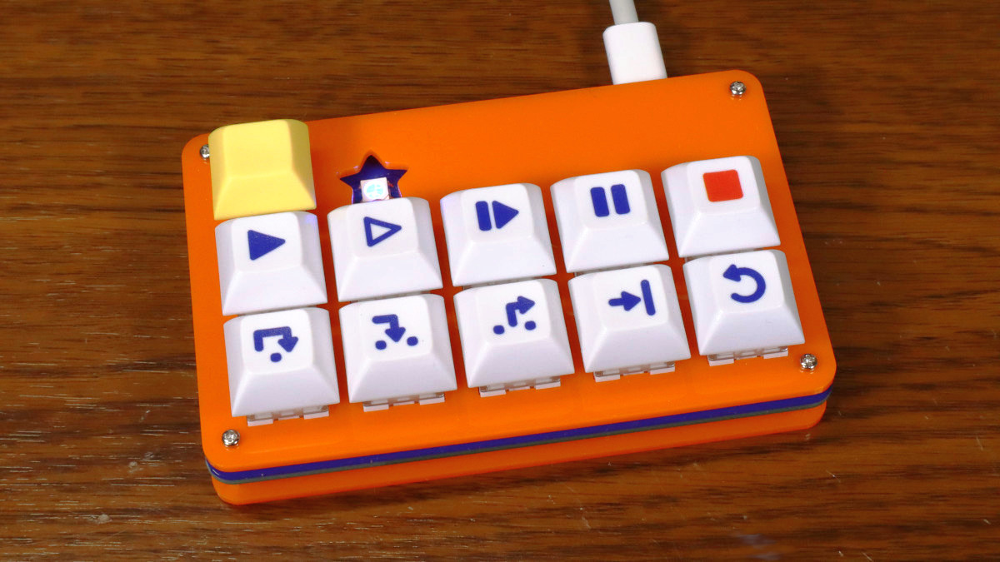
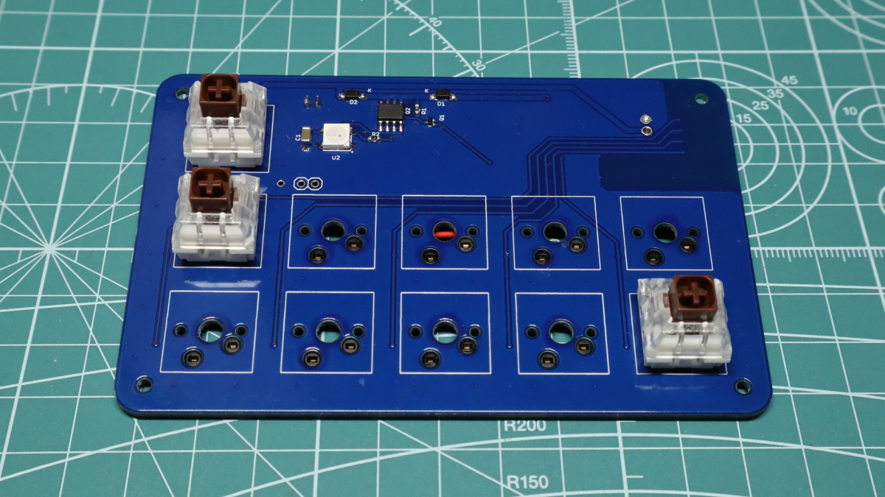
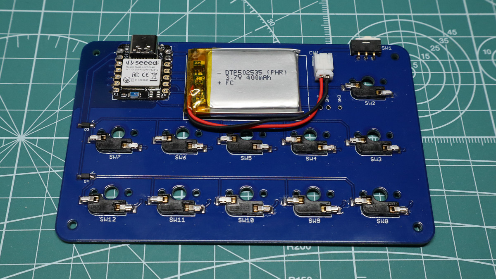

DebuggerKB
=========

## 概要
IDEでのデバッグ関連のショートカットキーを並べた専用キーボードです。

* 有線接続(USB HID)と無線接続(BLE HID)の両方に対応。
* LiPoバッテリー(400mAh)と充電回路を内蔵。
* キーマップは最大8パターンまで登録でき、切替キーでキーマップを切り替え可能。
* キーマップはUSB接続時にブラウザアプリから設定可能。 (Chrome や Edge など Web Serial API に対応したブラウザが必要)
* Nordic nRF52840 搭載。 (Seeed Studio XIAO nRF52840)
* Arduinoベースの独自ファームウェア。 (QMKではありません。)

## キースイッチとキーキャップについて
* キースイッチは Cherry MX スイッチ互換の Keilh BOX スイッチを使用しました。
* デバッガの操作という用途を考慮し、軸種はクリック感のある茶軸を選びました。
* [Kailh Switch Socket](https://shop.yushakobo.jp/products/a01ps) を使用しており、キースイッチの着脱が可能です。
* パターン設計の都合で、キースイッチの向きは North Facing (LED穴が上側) にしました。
* キーキャップは、DSAプロファイルのものを使用しました。
* キーキャップの印字は、[遊舎工房](https://yushakobo.jp/)さんのキーキャップUVプリントサービスを利用しました。
* キーキャップの印字データは、白キーキャップを前提として作成しました。(下地の白インクのデータ無し)

## 筐体について
* ボトムプレートとトッププレートは厚さ2mmのアクリル板(キャスト材)を使用しました。
* アクリル板の加工は、[工房Emerge+](https://www.emergeplus.jp/)さんのレーザー加工サービスを利用しました。

## プリント基板について
* 基板製造は[PCBGOGO](https://www.pcbgogo.jp/)さんのサービスを利用しました。
* 実装は手ハンダです。

## ファイル一覧

* hard/
    * DebuggerKB.sch/brd : 回路/基板設計データ(Eagle形式)
    * DebuggerKB.pdf : 回路図(PDF)
    * DebuggerKB.zip : ガーバーデータの圧縮ファイル
    * DebuggerKB_BOM.xlsx : BOMリスト(Excel形式)
* mecha/
    * A5_DebuggerKB.svg : プレート(アクリル板)の加工データ
    * DSA_1u_4x4_DebuggerKB.svg : キーキャップのUV印刷データ
* firm/DebuggerKB/
    * DebuggerKB.ino : キーボードのファームウェア (Arduinoスケッチ)
    * \*.h, \*.cpp: ファームウェアで使用する各種クラス宣言と実装
* app/DebuggerKB_Config/ 
    * index.html : キーマップ設定アプリ (ブラウザアプリ)
    * \*.js, \*.png, css/\*, lib/\* : キーマップ設定アプリで使用する各種ファイル

